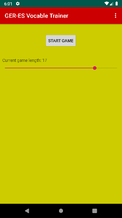

# German-Spanisch Vocabular Trainer
Last updated on Sunday, 29. December 2019 09:47PM 
  
**Game Version 1.1.0**

## What is the app about?
This App is a simple way of learning vocables. It is meant to be used for either spanish or german speaking people.  

The **master - Branch** is always the latest stable version, development may have some critical bugs and is, as the title says, in *development*.

### Features
This app offers the following features:
- a place to save your vocables safely and always with you
- a game where you have to translate random german words into spanish in a given time
- a lightweight and easy to-use app

## Techincal Features
- Persistent Storage achieved with a simple room database
- Responsive GUI thanks to the Fragment/FragmentViewModel Architecture
- Using LifecycleEvents for natural app behaviour
- RecycleView implementation for translation lists
- Search Function to go through data

### Dependencies
No additional dependencies requiered.
 

